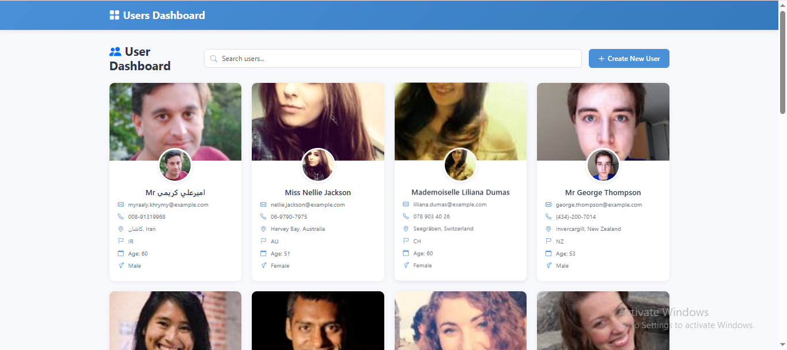
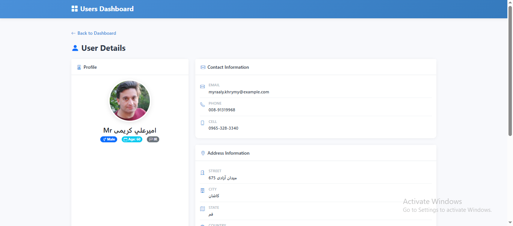
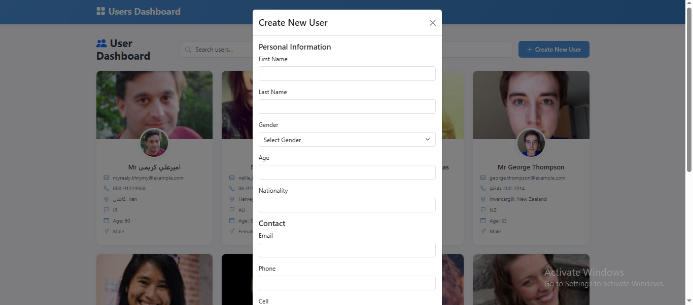
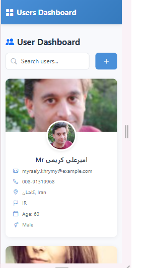

# Users Dashboard

A responsive React application that displays a list of users fetched from the Random User API. The application allows users to browse profiles, search users by name, view detailed information, and create new users locally without a backend.

## Features

* Display users in a responsive card layout
* Search users by name
* View detailed information for each user
* Client-side Create New User functionality
* Global state management using React Context API
* Responsive design using Bootstrap 5
* Skeleton loading while fetching data
* Error handling with retry option
* No Users Found state for search results
* React Router DOM for navigation

---

## Tech Stack

* React (Functional Components & Hooks)
* React Context API
* React Router DOM
* Bootstrap 5
* Bootstrap Icons
* Fetch API
* CSS

---

## Folder Structure

```text
src
│
├── components
│   ├── CreateUserModal
│   ├── UserCard
│   ├── UserForm
│   ├── SkeletonCard
│   ├── SkeletonDetails
│   └── NoUsersFound
│
├── context
│   ├── UserContext
│   └── UserProvider
│
├── pages
│   ├── Dashboard
│   └── UserDetails
│
├── services
│   └── userService
│
├── hooks
│   └── useDebounce
│
├── App.js
└── index.js
```

---

## Environment Variables

Create a `.env` file in the project root.

```env
REACT_APP_API_URL=https://randomuser.me/api
```

---

## Installation

Clone the repository.

```bash
git clone https://github.com/unaib-saiyad/user-dashboard.git
```

Move into the project directory.

```bash
cd users-dashboard
```

Install dependencies.

```bash
npm install
```

Start the development server.

```bash
npm start
```

The application will run on:

```
http://localhost:3000
```

---

## API

User data is fetched from:

https://randomuser.me/api

The API URL is managed through environment variables for easy configuration.

---

## Available Features

### Dashboard

* Displays all users
* Responsive Bootstrap card layout
* Search users by name
* Skeleton loading
* Error handling
* Empty search state
* Create New User button

### User Details

Displays detailed information including:

* Profile picture
* Full name
* Gender
* Age
* Nationality
* Email
* Phone
* Cell number
* Address
* Geographic coordinates
* Timezone information

### Create New User

* Client-side only
* Adds a new user to the global Context state
* No backend persistence

---

## State Management

The application uses **React Context API** to maintain a global list of users.

The users are fetched once during application initialization and shared across all pages.

---

## Routing

| Route       | Description  |
| ----------- | ------------ |
| `/`         | Dashboard    |
| `/user/:id` | User Details |

---

## Future Improvements

* Edit User
* Delete User
* Pagination
* Server-side Search
* Dark Mode
* Image Upload for New Users
* Form Validation using React Hook Form
* Unit Testing

---

## Screenshots

* Dashboard : 
* User Details : 
* Create User Modal : 
* Mobile View : 

---

## Author

Developed by **Saiyad Unaib**
